# Fitness Trainer Appointment Scheduling Website Documentation

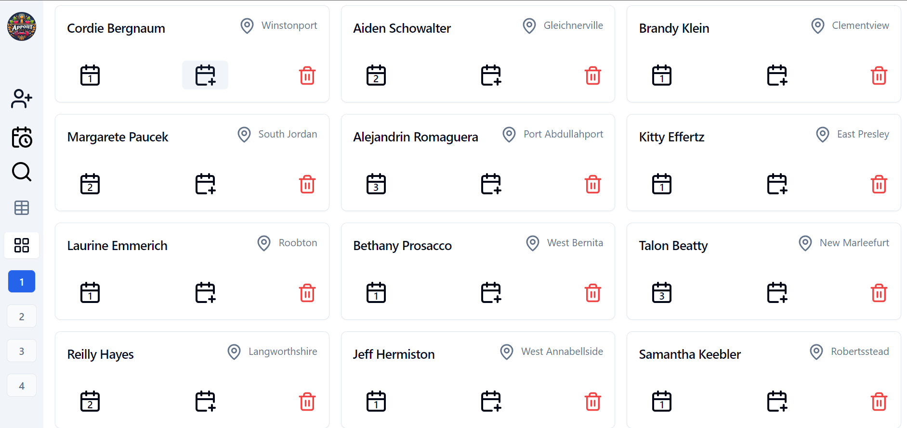
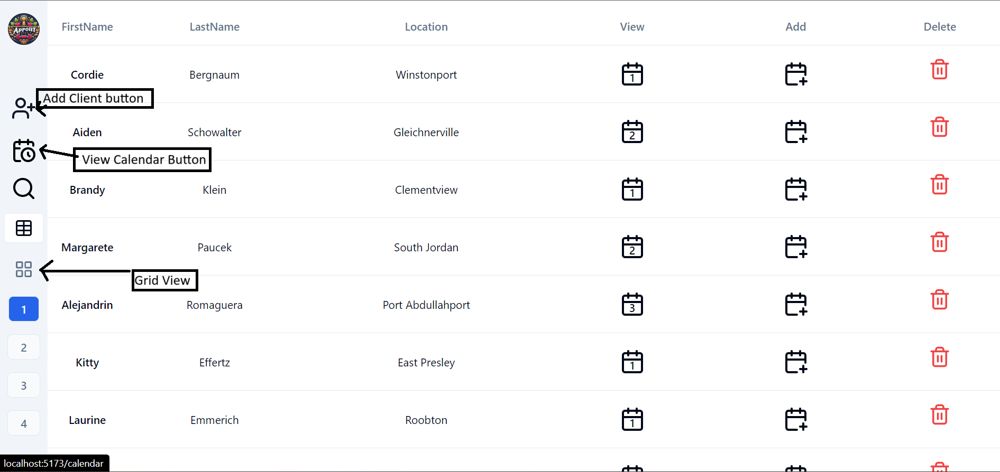

## Table of Contents

- [Fitness Trainer Appointment Scheduling Website Documentation](#fitness-trainer-appointment-scheduling-website-documentation)
  - [Table of Contents](#table-of-contents)
  - [Introduction](#introduction)
  - [Technology Stack](#technology-stack)
  - [Setup](#setup)
  - [User Interface](#user-interface)
    - [Design](#design)
    - [Grid Layout](#grid-layout)
    - [Table Layout](#table-layout)
    - [Client Details](#client-details)
  - [Adding Appointments](#adding-appointments)
    - [Initiating Appointment Creation](#initiating-appointment-creation)
    - [Date and Time Picker](#date-and-time-picker)
  - [Editing Appointments](#editing-appointments)
    - [Editing Existing Appointments](#editing-existing-appointments)
    - [Inline Client Information Editing](#inline-client-information-editing)
  - [Deleting Appointments](#deleting-appointments)
    - [Deletion Method](#deletion-method)
    - [Confirmation Step](#confirmation-step)
  - [Appointments Field](#appointments-field)
    - [Display Format](#display-format)
  - [User-Friendly Experience](#user-friendly-experience)
    - [Error Messages and Notifications](#error-messages-and-notifications)
    - [Feedback](#feedback)
  - [Calendar Page (Bonus Assignment)](#calendar-page-bonus-assignment)
    - [Visibility](#visibility)
    - [Appointment Display](#appointment-display)
  - [Search Feature](#search-feature)
    - [Search by firstName, lastName and location](#search-by-firstname-lastname-and-location)

## Introduction

Welcome to the Fitness Trainer Appointment Scheduling Website! This web application is designed to empower fitness trainers with a streamlined and efficient platform for managing client appointments. With a modern and user-friendly interface, my goal is to provide trainers with the tools they need to effortlessly handle appointment scheduling, client details, and even offer a bonus calendar feature for enhanced organization.

## Technology Stack

- I have used **Vite-react**, **Typescript**.
- For state management  **Redux Tookit**.
- For routing **React Router Dom**
- For UI **Shadcn UI** and **Tailwind Css**

## Setup

1. Clone this repository

```node
   cd AppointCraft
   ```

2. Install Dependencies

```node
   npm install
   ```

3. Run Project

```node
   npm run dev
   ```

## User Interface

### Design

- Designed a modern and responsive user interface using [shadcn Ui](https://ui.shadcn.com/) and [Tailwindcss](https://tailwindcss.com/).  
- Trainer can **toggle grid and table view** by clinking on respective buttons
- Added a **paginatin** to show few appointments

### Grid Layout

- Created a clean and intuitive grid layout where each row corresponds to a different client.
  
### Table Layout

- Created a clean and intuitive Table layout where each row corresponds to a different client.

### Client Details

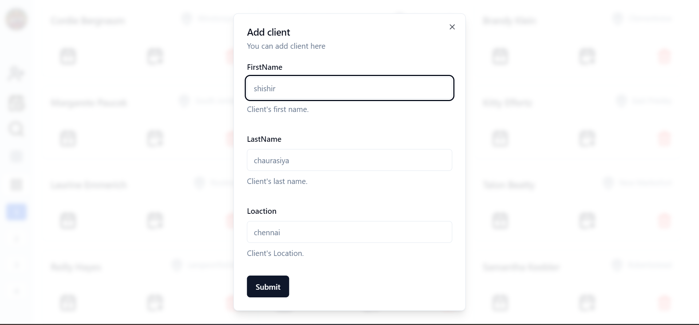

- **Edit First Name:** The application offers an intuitive and seamless interface for trainers to update first names within the cell, providing flexibility and ease in managing client information.

- **Edit Last Name:** Utilize a user-friendly, inline editable field to update the last names of clients.

- **Edit Location:** Allow trainers to customize and edit client locations directly within the application.

- **Manage Appointments:** Streamline the scheduling process by displaying and allowing the addition of multiple appointment date-times for each client. This feature empowers trainers to efficiently schedule, view, and update appointments, enhancing the overall appointment management experience. It is tailored to accommodate the dynamic scheduling needs of fitness trainers and their clients.

## Adding Appointments

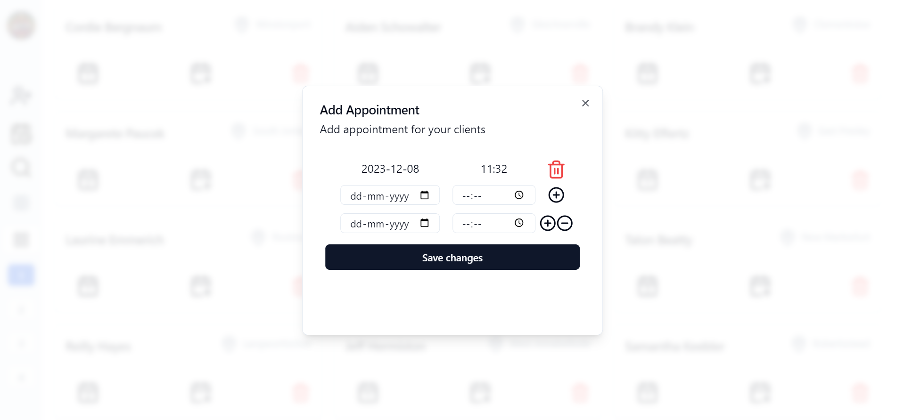

### Initiating Appointment Creation

- Implemented an intuitive mechanism for the fitness trainer to add new appointments for clients.
- Included a clearly labeled button or icon within each client's row to initiate the appointment creation process.

### Date and Time Picker

- When adding appointments, used a date and time picker to select the date and time of the appointment.

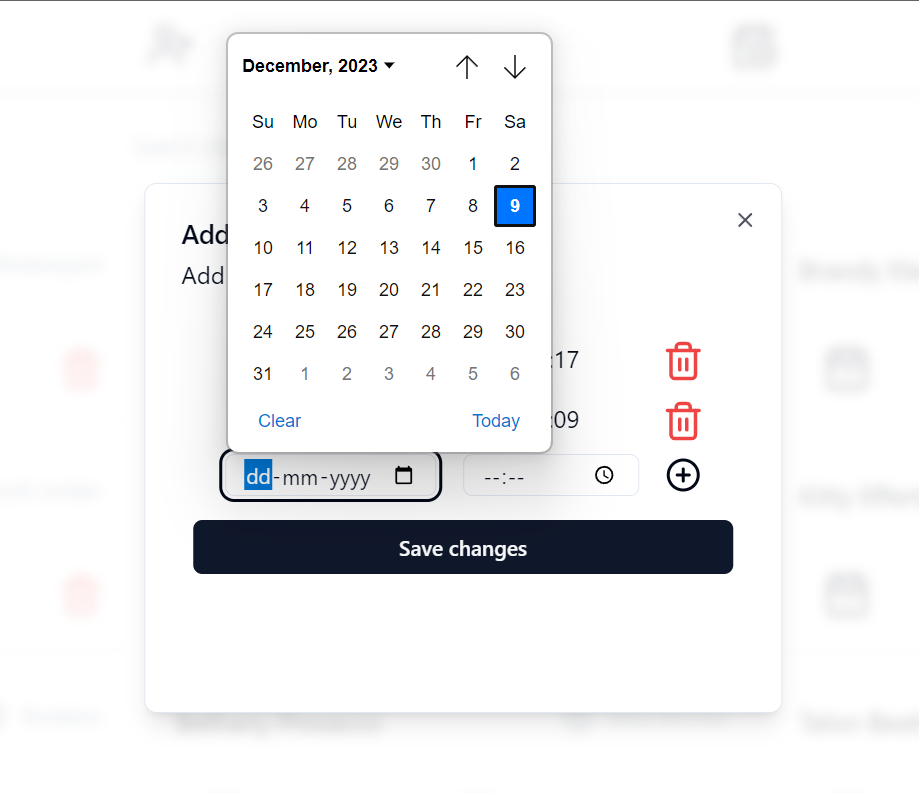
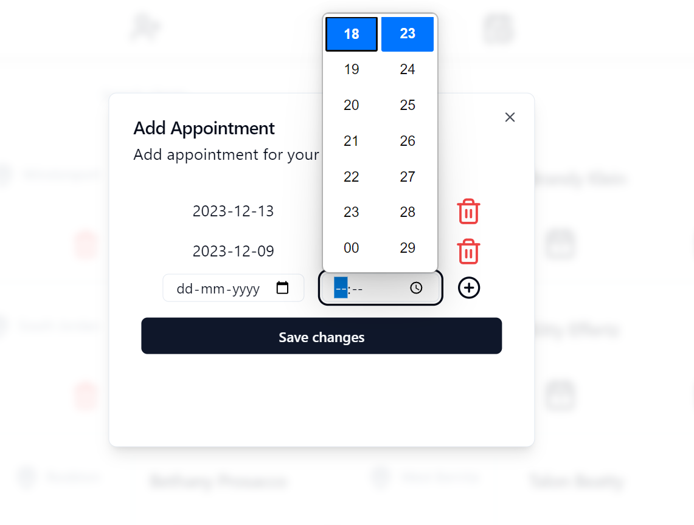

## Editing Appointments

---
Developed A **highly reusable** component to impelment inline edit withing the cell row and same component can be used to edit **firstName**, **lastName**, **location**, **date** and **time**. Just **double click** on the field you want to edit.

---

### Editing Existing Appointments

- Allow the fitness trainer to easily edit existing appointments for clients.
- Provided a way to edit both the date and time of existing appointments.

### Inline Client Information Editing

- Implemented the ability to edit client information (First Name, Last Name, and Location) inline within the grid.

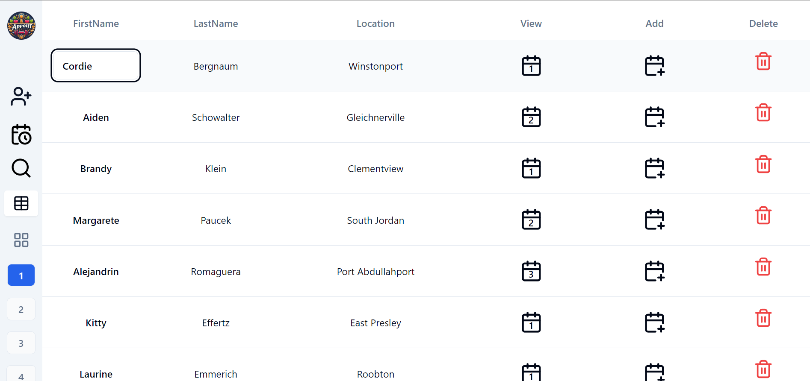

## Deleting Appointments

### Deletion Method

- Developed a straightforward method to delete individual appointments for clients.

### Confirmation Step

- Implemented a confirmation alert dialog using [shadcn alert dialog](https://ui.shadcn.com/docs/components/alert-dialog) to prevent accidental deletions.

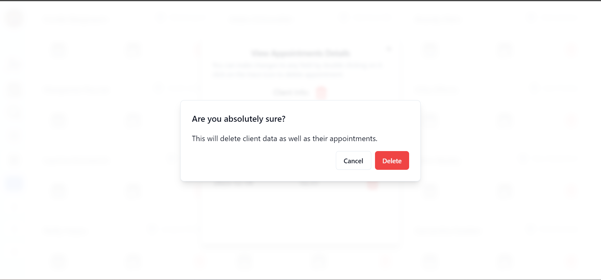

## Appointments Field

### Display Format

- The "Appointments" field is displaying all scheduled date-times for each client.
- In case of multiple appointments for a client, it will display them in a clear and organized manner within this field.

## User-Friendly Experience

---
  For this I have used [React-hot-toast](https://www.npmjs.com/package/react-hot-toast) Library

---

### Error Messages and Notifications

- Enhanced the user experience with informative error messages and notifications for successful actions (e.g., appointment added, edited, or deleted).

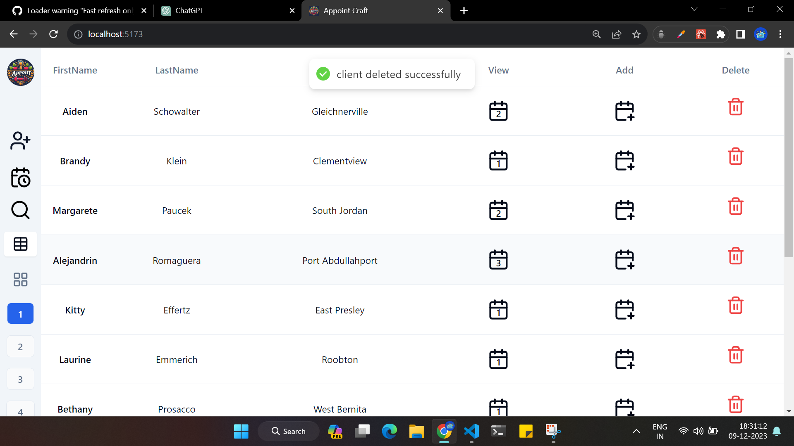

### Feedback

- Made sure that the interface provide a feedback to the trainer on the outcome of their actions.

## Calendar Page (Bonus Assignment)

---
I used [React-big-calendar](https://www.npmjs.com/package/react-big-calendar) to this bonus part

---

### Visibility

- Created a calendar page for fitness trainers, allowing them to conveniently view their scheduled appointments.
- The calendar page should become visible to the user when they click the "Calendar" button on the initial page.

### Appointment Display

- Each appointment entry on the calendar display the client's name for easy reference and on clicking a model will open with details of appint,emt along with a button to delete the appointment.

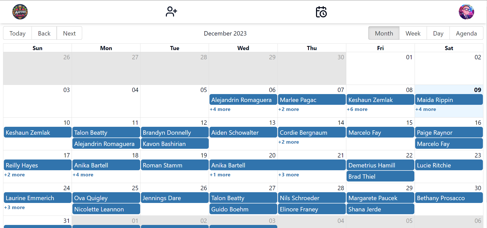

- On Cliking an appointment a dialog will be displayed with the following information

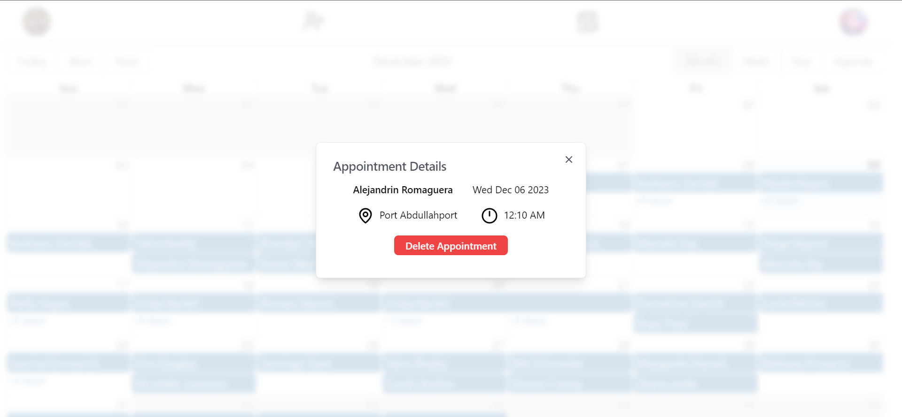

## Search Feature
  
### Search by firstName, lastName and location
  
- Train can search client by their names and location

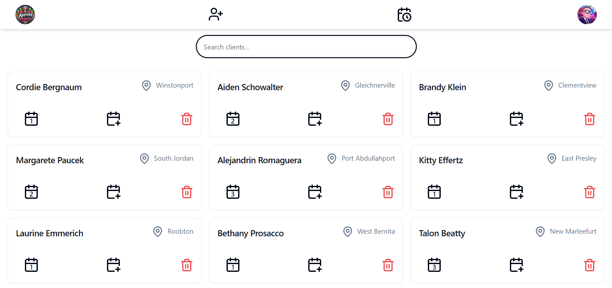

**Thank You**
